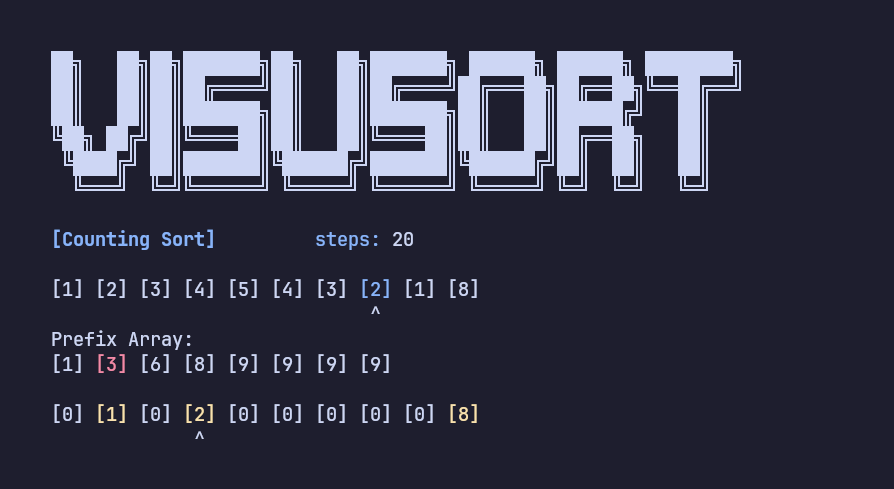

# VisuSort  

*A terminal-based interactive sorting algorithm visualizer written in C++*


|  |
| :------------------------------------------: |
| *Merge Sort visualization* |

|  |  |
| :-------------------------------------------------: | :-----------------------------------------------: |
| *Selection Sort visualization* | *Counting Sort visualization* |

|  |
| :------------------------------------------: |
| *With Theory* | *Theory behind Counting Sort* |

## 🎯 Supported Sorting Algorithms

- Selection Sort

- Insertion Sort

- Bubble Sort

- Quick Sort

- Merge Sort

- Heap Sort

- Counting Sort

## 💡 Prerequisites

- C++ compiler with C++20 support (g++, clang++)
- Python 3.x (for the interactive menu)
- Linux/Unix-like environment (or WSL on Windows)

## 🛠️ Installation

1. **Clone the repository:**
   ```bash
   git clone https://github.com/crypticsaiyan/visusort.git
   cd visusort
   ```

2. **Build the project:**
   ```bash
   # Using the installation script (recommended)
   chmod +x installation.sh
   ./installation.sh
   
   # Or manually
   g++ -O3 -DNDEBUG -march=native -s $(find . -name "*.cpp") -o main
   ```

## 📚 Usage

### Method 1: Interactive Python Menu (Recommended)

```bash
python3 visusort.py
```


### Method 2: Direct Command Line

```bash
./main <algorithm> <display_theory>
```

**Parameters:**
- `<algorithm>`: One of `selection`, `insertion`, `bubble`, `quick`, `merge`, `heap`, `counting`
- `<display_theory>`: `1` to show theory, `0` to skip

**Examples:**
```bash
# Run bubble sort with theory explanations
./main bubble 1

# Run quick sort without theory
./main quick 0

# Run merge sort with theory
./main merge 1
```

**Example Session:**
```
Enter the length of test array: 5
Enter the values separated by spaces: 64 34 25 12 22
```

## 🎨 Visual Elements

- **`^`**: Current element being processed
- **`*`**: Element being compared
- **Red highlighting**: Elements being swapped
- **Green highlight**: Element(s) currently being compared
- **Blue highlight**: Element(s) actively being processed or manipulated
- **Yellow highlight**: Element(s) that are sorted and in their final position
- **Comparison counter**: Real-time count of comparisons made

**Note:** The visual elements may vary slightly based on the terminal emulator used.

## ⚙️ Customization

### Animation Speed
You can adjust the animation speed by modifying the `pause_duration` value in `globals.cpp` and recompiling:

1. Open `globals.cpp`
2. Change the value of `pause_duration` (default is 200ms)
   - Lower values = faster animation
   - Higher values = slower animation
3. Recompile using the installation script:
   ```bash
   ./installation.sh
   ```

## 📝 License
MIT License

## 📊 Performance Notes

- **Small Arrays (< 20 elements)**: All algorithms perform similarly
- **Medium Arrays (20-100 elements)**: O(n log n) algorithms show clear advantages
- **Large Arrays (> 100 elements)**: Performance differences become very apparent
- **Counting Sort**: Excellent for arrays with small range of values

---

<div align="center">

**Made with ❤️ by crypticsaiyan**

⭐ **If you found this project useful, please consider giving it a star!** ⭐

[Report Bug](https://github.com/crypticsaiyan/visusort/issues) · [Request Feature](https://github.com/crypticsaiyan/visusort/issues)

</div>
